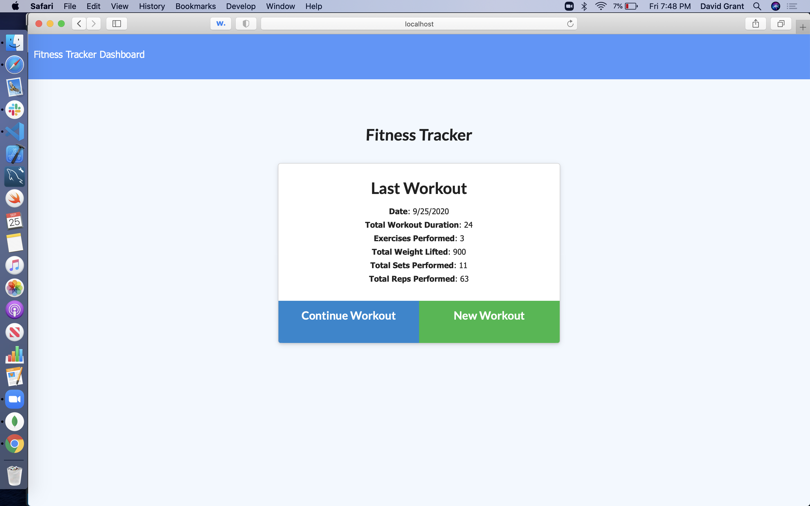

# workouts-Tracker---Assignment-12

Pretty straight forward. We needed to make a workout tracker for cardio and resistance exercises through mongoDB. Dashboard was not working correctly from a faulty code that was given to us but i finished all the rest. Instructor said dont worry about the dashboard. I am still working on trying to understand the relationship to variables in the server and in the routes but as i get help i slowly make sense of this.

